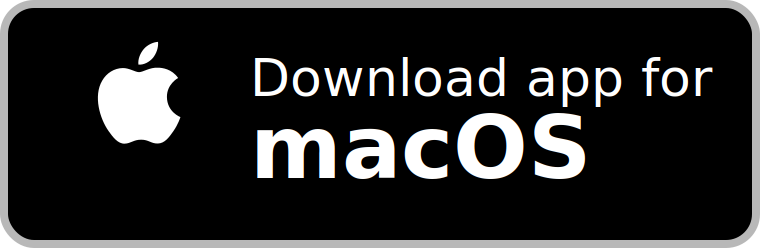
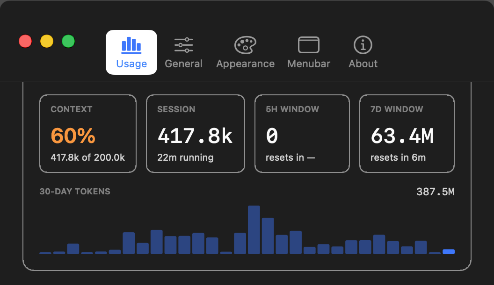

# ContextHUD

<p align="center">
  English | <a href="README.tr.md">Turkce</a>
</p>

<p align="center">
  <strong>Local-first repository context and native macOS usage visibility for coding agents.</strong>
</p>

<p align="center">
  ContextHUD keeps agents grounded in the repository they are working on, writes stable agent-readable briefs, and gives Claude Code and Codex usage a native macOS surface.
</p>

<p align="center">
  <a href="https://github.com/htahaozlu/context-hud/releases/latest/download/ContextHUD.dmg">
    
  </a>
</p>

<p align="center">
  <a href="https://github.com/htahaozlu/context-hud/releases/latest">
    
  </a>
  <a href="LICENSE">
    
  </a>
  
</p>

<table>
  <tr>
    <td valign="top" width="58%">

### What it does

ContextHUD solves two persistent problems in agent-driven development:

- repository context drifts faster than an agent brief can keep up
- usage and session state stay buried in terminal output and local transcripts

It addresses both through a local pipeline that continuously produces stable project summaries and a native macOS HUD for Claude Code and Codex activity.

    </td>
    <td valign="top" width="42%">

### Core surfaces

- Repository snapshots under `.context-hud/`
- Stable `AGENT.md` and `CLAUDE.md`
- CLI for refresh, watch, and global views
- Native AppKit menubar companion
- Markdown and JSON artifacts for tooling

    </td>
  </tr>
</table>

## Product Preview

<p align="center">
  
</p>

Native macOS usage window with rolling session visibility for Claude Code and Codex.

## Why ContextHUD exists

Modern coding agents need the same two things on every run:

1. a concise, current repository brief
2. a reliable view of recent usage and session behavior

Most workflows handle these inconsistently. ContextHUD standardizes them with local artifact generation and a native desktop surface, without requiring a hosted backend for repository summaries.

## Key capabilities

### Repository context generation

Each refresh writes agent-readable state into `.context-hud/`:

- `state.json`
- `brief-now.md`
- `brief-session.md`
- `brief-week.md`
- `AGENT.md`
- `hud.md`

For Claude Code compatibility, `CLAUDE.md` is mirrored at the repository root.

### CLI workflow

The CLI is the most reliable always-on interface today:

- `context-hud hud` refreshes the current repository and prints the HUD
- `context-hud snapshot` writes artifacts without printing the HUD
- `context-hud watch 30 .` keeps repository context fresh on an interval
- `context-hud global` builds a cross-project HUD under `~/.context-hud/`

### Native macOS companion

The optional companion app reads `~/.context-hud/hud.json` and provides:

- a compact menubar status view
- a native usage window for Claude Code and Codex
- settings for theme, language, and menubar title composition

The desktop UI is native AppKit. `detail.html` is an export artifact, not the primary app experience.

## Installation

### Install the CLI

```bash
cargo install --path .
```

### Install the macOS app

1. Open the latest release.
2. Download `ContextHUD.dmg`.
3. Drag `ContextHUD.app` into `Applications`.
4. Launch the app once from `Applications`.
5. Eject and delete the DMG.

### Install as a Zed dev extension

1. Open the Extensions view in Zed.
2. Choose `Install Dev Extension`.
3. Select this repository.
4. If needed, grant `process:exec` under `granted_extension_capabilities`.

## Usage

### Refresh the current repository

```bash
context-hud hud
```

### Write artifacts without printing the HUD

```bash
context-hud snapshot
```

### Keep repository context fresh

```bash
context-hud watch 30 .
```

### Generate the global HUD

```bash
context-hud global
context-hud watch-global 30
```

The global HUD is written to `~/.context-hud/hud.md`.

## Artifact layout

Each refresh writes the following files atomically:

- `.context-hud/state.json`
- `.context-hud/brief-now.md`
- `.context-hud/brief-session.md`
- `.context-hud/brief-week.md`
- `.context-hud/AGENT.md`
- `.context-hud/hud.md`
- `CLAUDE.md`

Atomic writes ensure agents do not observe partial state during refresh.

## Data sources

ContextHUD combines:

- Git branch, recent commits, and worktree status
- file activity inferred from repository mtimes
- Claude Code usage from `~/.claude/projects/**/*.jsonl`
- Codex CLI usage from `~/.codex/sessions/**/*.jsonl`

No external service is required for the core repository summaries. Usage aggregation relies on locally available transcript data and `python3`.

## Packaging

The repository includes scripts for the optional macOS companion build:

```bash
scripts/build-menubar-app.sh
scripts/create-macos-dmg.sh
```

Artifacts:

- `dist/ContextHUD.app`
- `dist/ContextHUD.dmg`

## Current constraints

- Zed `extension_api` `0.7` does not expose a load-time worktree hook
- Zed does not yet expose a persistent HUD primitive for extensions
- agent auto-injection is file-based today through `.context-hud/AGENT.md` or `CLAUDE.md`

Because of those limits, the CLI remains the most dependable always-on surface.

## Repository layout

- `src/` core engine, artifact rendering, Zed integration, and usage aggregation
- `src/bin/context-hud.rs` standalone CLI entry point
- `menubar/context-hud.swift` optional macOS companion app
- `examples/snapshot.rs` native development harness

## Development

```bash
cargo check
cargo run --example snapshot
```

## Community

- Questions and usage help: GitHub Discussions
- Bugs and feature requests: GitHub Issues
- Contribution guide: `CONTRIBUTING.md`
- Security reporting: `SECURITY.md`

## License

Apache-2.0
